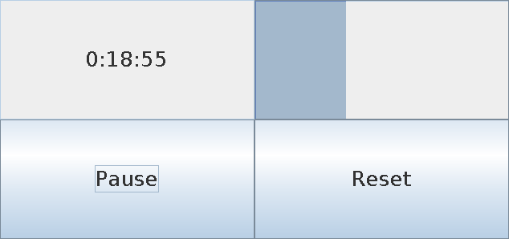

# perfect-timer

A simple GUI timer app.

## Features

- GUI (Seesaw/Swing)
- Basic start/pause/reset buttons

### Anti-features (mostly due to JVM)

- Long start-up time
- Heavy memory usage

## Installation

1. Install Clojure and [Leiningen] (https://github.com/technomancy/leiningen).

2. Check out the git repo:

        git clone https://github.com/mrkrd/perfect-timer.git
        cd perfect-timer

3. Run using Leiningen:

        lein run

## Contribute & Support

- Issue Tracker: https://github.com/mrkrd/perfect-timer/issues
- Source Code: https://github.com/mrkrd/perfect-timer

## License

Copyright © 2015 Marek Rudnicki

Distributed under the Eclipse Public License either version 1.0 or (at
your option) any later version.
